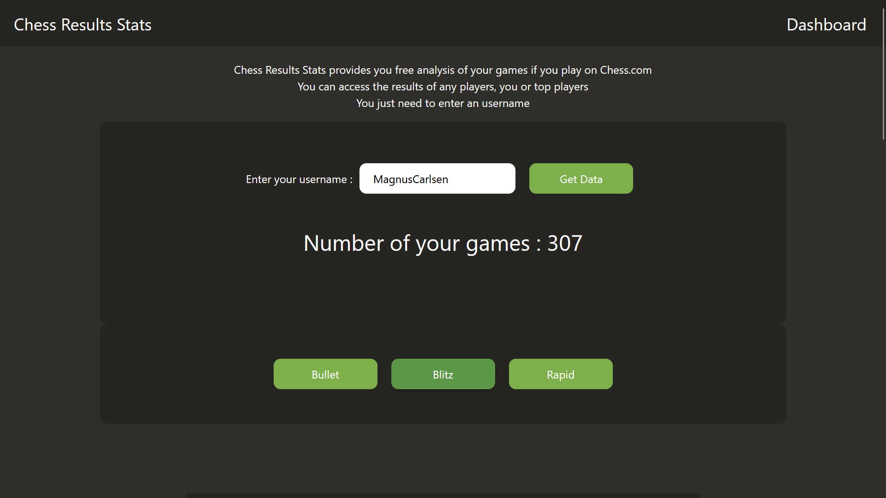
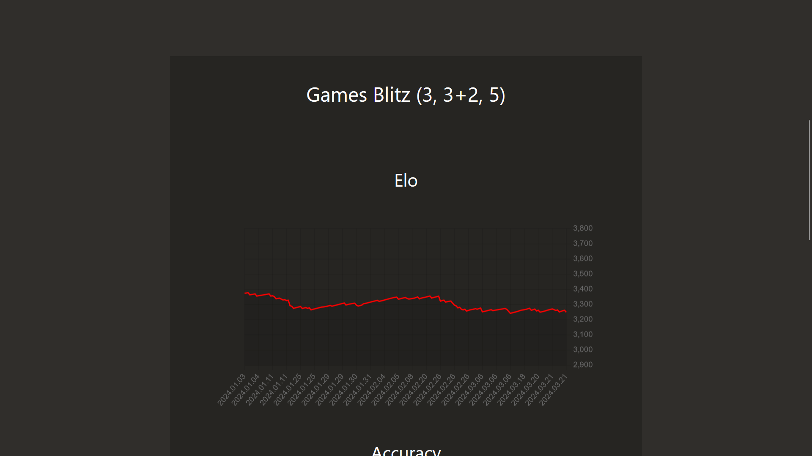
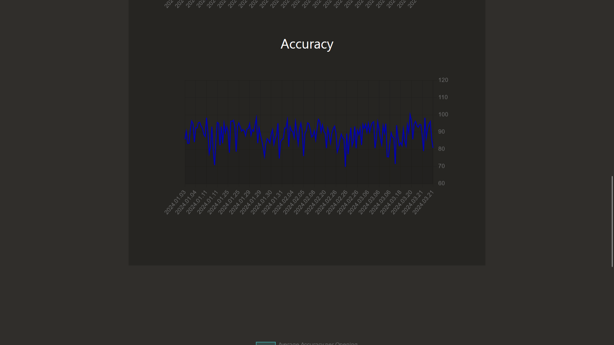
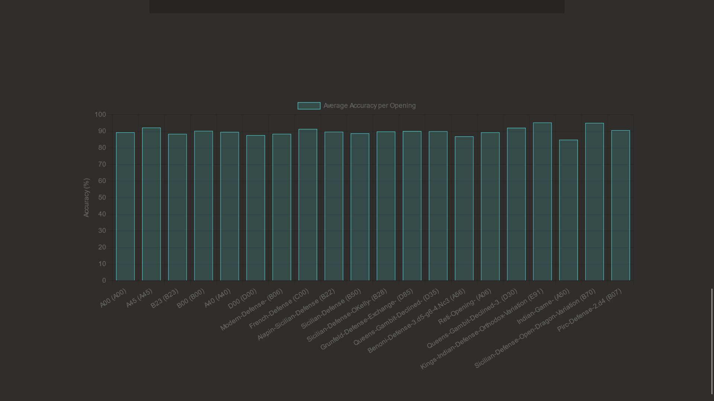

# Chess Results Stats - Angular

## The project

Chess Results Stats - Angular is the frontend for

-   ChessResultStats-CSharp https://github.com/ironjerseys/ChessResultStats-CSharp

It is build with Angular 17 and TypeScript 5.4.3

You can see it here on Azure : https://chessresultsstats.com/

## How it works

This website calls an API from Chess.com to collect data from the wanted username

You can see the results in the charts

## How to install it :

-   Git clone https://github.com/ironjerseys/ChessResultsStats-Angular.git
-   cd ChessResultsStats-Angular

```
npm install
```

```
npm run start
```





