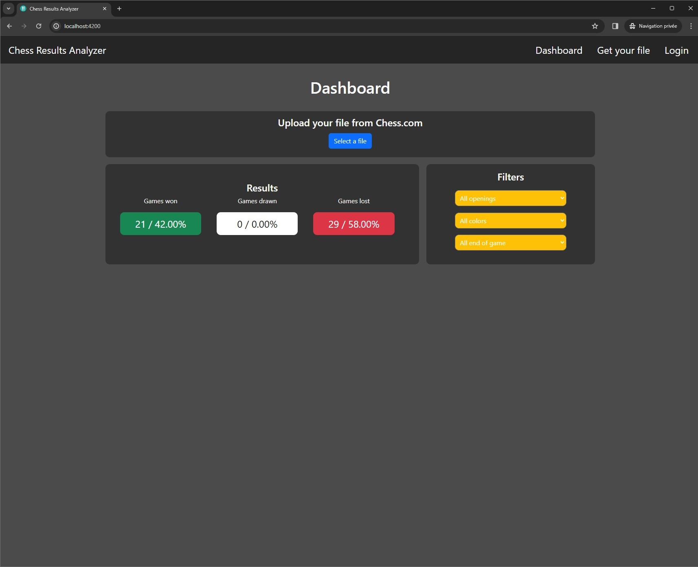

# LinqProject-Angular

LinqProject-Angular is the front end for both LinqProject-API https://github.com/jorisreynes/LinqProject-API and ChessResultAnalyzerJava https://github.com/jorisreynes/ChessResultAnalyzerJava

How to install it :

For the finished C# version change the date as of October 1st 2023 and download the archive
Extract the archive and change the name for LinqProject-Angular
cd LinqProject-Angular

- npm install

- npm run start

You can upload your Chess.com file by clicking the upload button, once the file is send to the C# bacjend API you can see the results

